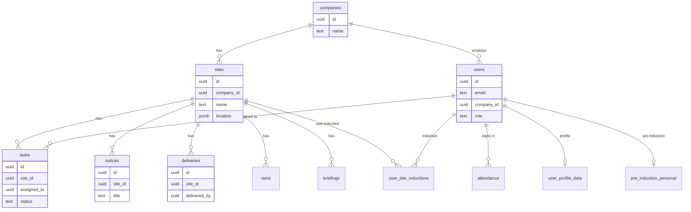

# Construction Runner Database Schema (Public)

Generated from current Supabase schema. View in any Markdown viewer that supports Mermaid, or use [Mermaid Live Editor](https://mermaid.live).

## Entity Relationship Diagram

```mermaid
erDiagram
    companies {
        uuid id PK
        text name
        timestamptz created_at
        timestamptz updated_at
    }

    users {
        uuid id PK
        text email
        uuid company_id FK
        text role
        text profile_id
        text status
        boolean disabled
        boolean approved
        boolean superuser
        text firebase_uid
        timestamptz created_at
        timestamptz updated_at
    }

    sites {
        uuid id PK
        uuid company_id FK
        text name
        jsonb location
        jsonb geofence
        numeric latitude
        numeric longitude
        timestamptz created_at
        timestamptz updated_at
    }

    attendance {
        uuid id PK
        uuid user_id FK
        uuid site_id FK
        uuid company_id FK
        text action
        timestamptz timestamp
    }

    tasks {
        uuid id PK
        uuid site_id FK
        uuid company_id FK
        uuid assigned_to FK
        text status
        text description
        timestamptz created_at
    }

    notices {
        uuid id PK
        uuid site_id FK
        uuid company_id FK
        text title
        text body
        jsonb attachments
        timestamptz created_at
    }

    deliveries {
        uuid id PK
        uuid site_id FK
        uuid company_id FK
        uuid delivered_by FK
        jsonb proof_photos
        text status
        timestamptz created_at
    }

    rams {
        uuid id PK
        uuid site_id FK
        uuid company_id FK
        uuid uploaded_by FK
        text type
        text version
        text file_url
        timestamptz created_at
    }

    briefings {
        uuid id PK
        uuid company_id FK
        uuid site_id FK
        text title
        text body
        text file_url
        timestamptz created_at
    }

    coshh {
        uuid id PK
        uuid company_id FK
        uuid site_id FK
        text title
        text substance
        jsonb hazard_symbols
        text file_url
    }

    safety_alerts {
        uuid id PK
        uuid company_id FK
        uuid site_id FK
        text title
        text description
        text severity
        timestamptz expires_at
    }

    site_rules {
        uuid id PK
        uuid company_id FK
        uuid site_id FK
        text title
        text body
        text category
    }

    site_subcontractors {
        uuid site_id PK,FK
        uuid company_id PK,FK
    }

    assigned_operatives {
        uuid id PK
        uuid site_id FK
        uuid user_id FK
        timestamptz assigned_at
    }

    briefing_acknowledgements {
        uuid id PK
        uuid user_id FK
        uuid briefing_id FK
        timestamptz acknowledged_at
        text signature_url
    }

    certifications {
        uuid id PK
        uuid profile_id
        uuid user_id FK
        text type
        timestamptz issued_at
        timestamptz expires_at
    }

    training {
        uuid id PK
        uuid profile_id
        uuid user_id FK
        text type
        timestamptz completed_at
    }

    user_profile_data {
        uuid id PK
        uuid user_id FK
        text address
        text town
        text postcode
        text date_of_birth
        text job_title
        text national_insurance
    }

    pre_induction_personal {
        uuid user_id PK,FK
        text full_name
        date date_of_birth
        text phone
        text email
    }

    pre_induction_right_to_work {
        uuid user_id PK,FK
        text passport_url
        date passport_expiry
        boolean right_to_work_verified
    }

    pre_induction_medical {
        uuid user_id PK,FK
        text medical_declaration
        boolean fit_to_work
    }

    pre_induction_training {
        uuid user_id PK,FK
        boolean rams_accepted
        text rams_version
        jsonb training_records
    }

    pre_induction_declarations {
        uuid user_id PK,FK
        boolean operative_declaration_accepted
    }

    pre_induction_certifications {
        uuid user_id PK,FK
        jsonb certifications
    }

    user_site_inductions {
        uuid user_id PK,FK
        uuid site_id PK,FK
        text status
        timestamptz completed_at
        boolean grandfathered
    }

    notices_read {
        uuid id PK
        uuid user_uid FK
        uuid notice_id FK
        timestamptz read_at
    }

    settings {
        uuid id PK
        uuid company_id FK
        jsonb config
    }

    medical_records {
        uuid id PK
        uuid user_id FK
        text title
        text file_url
        timestamptz created_at
    }

    upload_logs {
        uuid id PK
        uuid user_id FK
        text path
        timestamptz created_at
    }

    registrations {
        uuid id PK
        uuid company_id FK
        text email
        text status
    }

    audit_logs {
        uuid id PK
        text user_id
        text action
        timestamptz timestamp
        jsonb metadata
    }

    user_roles {
        uuid id PK
        uuid user_id FK
        uuid company_id FK
        text role
    }

    %% Relationships
    companies ||--o{ users : "company_id"
    companies ||--o{ sites : "company_id"
    companies ||--o{ settings : "company_id"
    companies ||--o{ registrations : "company_id"

    sites ||--o{ attendance : "site_id"
    sites ||--o{ tasks : "site_id"
    sites ||--o{ notices : "site_id"
    sites ||--o{ deliveries : "site_id"
    sites ||--o{ rams : "site_id"
    sites ||--o{ briefings : "site_id"
    sites ||--o{ coshh : "site_id"
    sites ||--o{ safety_alerts : "site_id"
    sites ||--o{ site_rules : "site_id"
    sites ||--o{ assigned_operatives : "site_id"
    sites ||--o{ site_subcontractors : "site_id"
    sites ||--o{ user_site_inductions : "site_id"

    users ||--o{ attendance : "user_id"
    users ||--o{ tasks : "assigned_to"
    users ||--o{ deliveries : "delivered_by"
    users ||--o{ rams : "uploaded_by"
    users ||--o{ briefing_acknowledgements : "user_id"
    users ||--o{ certifications : "user_id"
    users ||--o{ training : "user_id"
    users ||--o{ user_profile_data : "user_id"
    users ||--o| pre_induction_personal : "user_id"
    users ||--o| pre_induction_right_to_work : "user_id"
    users ||--o| pre_induction_medical : "user_id"
    users ||--o| pre_induction_training : "user_id"
    users ||--o| pre_induction_declarations : "user_id"
    users ||--o| pre_induction_certifications : "user_id"
    users ||--o{ user_site_inductions : "user_id"
    users ||--o{ notices_read : "user_uid"
    users ||--o{ medical_records : "user_id"
    users ||--o{ upload_logs : "user_id"

    briefings ||--o{ briefing_acknowledgements : "briefing_id"
    notices ||--o{ notices_read : "notice_id"
```

## Simplified Core Entities

## Table Summary

| Table | Purpose |
|-------|---------|
| `companies` | Tenant/organization root |
| `users` | App users (admins, managers, operatives) |
| `sites` | Work locations (belong to company) |
| `attendance` | Check-in/check-out records at sites |
| `tasks` | Site tasks, optionally assigned to users |
| `notices` | Site notices |
| `deliveries` | Delivery records per site |
| `rams` | Risk assessment method statements |
| `briefings` | Site briefings |
| `coshh` | COSHH safety data sheets |
| `safety_alerts` | Safety alerts per site |
| `site_rules` | Site rules/docs |
| `site_subcontractors` | Site–company subcontractor links |
| `assigned_operatives` | Users assigned to sites |
| `briefing_acknowledgements` | User acknowledgements of briefings |
| `certifications` | User certifications |
| `training` | User training records |
| `user_profile_data` | Extended user profile |
| `pre_induction_*` | Pre-induction checklist (personal, R2W, medical, training, etc.) |
| `user_site_inductions` | User induction status per site |
| `notices_read` | Notice read receipts |
| `settings` | Company/global settings |
| `medical_records` | User medical records |
| `upload_logs` | File upload audit |
| `registrations` | Pending user registrations |
| `audit_logs` | Action audit trail |
| `user_roles` | User–company role mapping |
